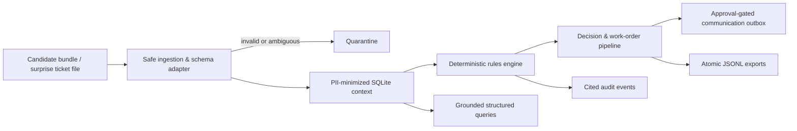

# Synq AI Forward Deployment Challenge — Meridian Freight

A deterministic, PII-safe backend for turning Meridian Freight breakdown tickets into auditable work orders and approval-gated customer communications.

## Challenge overview

This project implements the backend portion of the Synq AI Forward Deployment Challenge. It ingests the supplied operational corpus, normalizes known data-quality issues, applies explicit dispatch policies, and produces safe operational outputs. It is intentionally conservative: a missing operational fact produces a manual hold, never a guessed dispatch decision.

## Problem statement

Breakdown operations depend on fragmented tickets, fleet records, maintenance history, driver information, and informal policy evidence. The system must resolve those inputs consistently while protecting personal data, tolerating malformed or changed ticket files, preventing duplicate actions, and preserving a complete decision trail.

## Solution overview

The backend uses a local SQLite context store and deterministic policy functions. Source content is reduced to allowlisted structured facts before storage; sensitive free text and personal data do not enter query responses, exports, or audit logs. Each canonical ticket can create at most one work order and one approval-gated communication. Repeat runs are deterministic and idempotent.



## Folder structure

```text
.
├── candidate_bundle/          # Local-only challenge inputs (gitignored; never committed)
├── backend/
│   ├── app/                   # FastAPI, ingestion, rules, decisions, approvals, exports
│   ├── tests/                 # Deterministic backend test suite
│   ├── data/                  # Runtime SQLite database (gitignored)
│   ├── outputs/               # Generated JSONL artifacts (gitignored)
│   ├── audit/                 # Generated audit trail (gitignored)
│   ├── pyproject.toml
│   └── run.ps1
├── .env.example
├── CONTRIBUTING.md
└── LICENSE
```

## Features

- FastAPI service with OpenAPI/Swagger documentation.
- Deterministic, testable dispatch rules with cited evidence.
- PII minimization before context storage, exports, logs, and API responses.
- Ticket normalization, duplicate detection, entity-conflict capture, and quarantine.
- Strict JSON/CSV surprise-file adapter that rejects uncertain schema mappings.
- Exactly-once work-order and approval-message creation through stable identifiers and SQLite constraints.
- Approval-gated local outbox; no external communication is sent.
- Atomic, deterministically sorted JSONL exports and audit records.
- Grounded ticket and vehicle lookup responses based only on structured stored evidence.

## System workflow

1. Ingest reference sources and a supplied ticket file.
2. Normalize identifiers and reduce source data to PII-safe, structured facts.
3. Quarantine malformed tickets or ambiguous surprise-file schemas with explicit reason codes.
4. Evaluate deterministic rules against the ticket and cited context.
5. Create one work order and, where applicable, one pending approval message per canonical ticket.
6. Record cited audit events and regenerate sorted JSONL outputs atomically.
7. Require an authorized opaque role/operator handle before moving a message to the local sent outbox.

## API endpoints

| Method | Path | Purpose |
| --- | --- | --- |
| `GET` | `/health` | Service and database readiness check. |
| `POST` | `/run` | Ingest/process the default corpus or a safely scoped surprise-ticket file. |
| `POST` | `/approve` | Approve a pending ticket message into the local outbox. |
| `POST` | `/query` | Query one ticket or vehicle using structured evidence. |
| `GET` | `/ticket/{ticket_id}` | Retrieve a PII-safe, grounded ticket response. |
| `GET` | `/tickets` | List canonical ticket projections. |
| `GET` | `/vehicles` | List PII-safe vehicle projections. |
| `GET` | `/quarantine` | List ticket and file quarantines. |
| `GET` | `/docs` | Swagger UI. |
| `GET` | `/openapi.json` | OpenAPI schema. |

### Example API requests

```powershell
# Start the API from backend/
uvicorn app.api:app --host 127.0.0.1 --port 8000

Invoke-RestMethod http://127.0.0.1:8000/health
Invoke-RestMethod -Method Post http://127.0.0.1:8000/run -ContentType 'application/json' -Body '{}'
Invoke-RestMethod -Method Get http://127.0.0.1:8000/ticket/TKT-0020
Invoke-RestMethod -Method Post http://127.0.0.1:8000/query -ContentType 'application/json' -Body '{"vehicle_reg":"UP86CM7252"}'
Invoke-RestMethod -Method Post http://127.0.0.1:8000/approve -ContentType 'application/json' -Body '{"ticket_id":"TKT-0020","approved_by":"role-dispatch","approved_at":"2026-08-30T10:00:00+05:30"}'
```

## Installation

Requires Python 3.11 or newer.

```powershell
cd backend
python -m venv .venv
.\.venv\Scripts\Activate.ps1
pip install -e .[test]
```

Alternatively, from the repository root on Windows:

```powershell
.\backend\run.ps1
```

## Environment variables

The deterministic backend currently requires no secrets or environment variables. Copy `.env.example` only if preparing the future grounded-explanation assistant phase:

```powershell
Copy-Item .env.example .env
```

`OPENAI_API_KEY` is deliberately unused by the current dispatch pipeline. Future assistant features must use it only for evidence-grounded explanations, never for dispatch decisions, and must redact/minimize context before any model call.

## Running locally

From `backend/` after installation:

```powershell
python -m app.run
uvicorn app.api:app --host 127.0.0.1 --port 8000
```

Open [http://127.0.0.1:8000/docs](http://127.0.0.1:8000/docs) for the interactive API documentation.

Generated runtime files appear under `backend/data/`, `backend/outputs/`, and `backend/audit/`; they are intentionally excluded from Git.

## Running tests

```powershell
cd backend
python -m unittest discover -s tests -v
```

The current backend suite has 24 tests covering ingestion, validation, redaction, rules, selection, pipeline idempotency, approval behavior, queries, surprise-file handling, and API safety.

## Deployment on Render

Create a Render **Web Service** from this repository with these settings:

| Setting | Value |
| --- | --- |
| Runtime | Python 3 |
| Root directory | `backend` |
| Build command | `pip install .` |
| Start command | `uvicorn app.api:app --host 0.0.0.0 --port $PORT` |

This repository intentionally excludes `candidate_bundle/` and all original challenge data. For a permitted local run, place an authorized corpus alongside `backend/`; never commit it. For a deployed environment, provision only approved, PII-reviewed input data through a secured runtime data source before invoking `/run`. The default SQLite database and JSONL/audit artifacts are local filesystem state. For an environment that must retain data across redeploys, attach a Render persistent disk and configure the application storage path before production use; otherwise a redeploy starts with a fresh local context.

Do not set `OPENAI_API_KEY` for the current backend: it is not needed until the future explanation-only assistant phase is implemented.

## Security and PII handling

- Candidate source files are never copied wholesale into the context database.
- Raw names, phones, email addresses, Aadhaar values, driver-license values, and mechanics/free-form operational text are excluded from persisted context and evaluator-visible artifacts.
- API list, lookup, quarantine, audit, and JSONL export outputs use PII-safe projections only.
- Approval identities must be opaque `role-*` or `operator-*` handles; personal names are rejected.
- Model-assisted decision-making is out of scope: all operational decisions are deterministic application logic.

## Design decisions

- **Safety over inference:** absent live availability, maintenance-due, refrigeration, driver pairing, hub-distance, or route-topology evidence returns a manual hold.
- **Exactly once:** stable deterministic identifiers plus database uniqueness constraints prevent duplicate work orders and outgoing messages on reruns.
- **No silent loss:** invalid tickets and ambiguous file mappings are quarantined with reason codes.
- **Evidence first:** rule results and query responses include source labels/citations, allowing operators to review the basis for a decision.
- **Simple deployment:** one FastAPI process and SQLite keep the MVP straightforward and inspectable.

## Limitations

- There is no frontend yet.
- The current API exposes structured queries; the natural-language, explanation-only assistant has not yet been implemented.
- There is no live telematics, routing, maintenance, or message-delivery integration. Missing live evidence therefore holds for manual review.
- SQLite is appropriate for this challenge MVP but needs durable storage configuration and operational controls for multi-instance production deployment.
- Approval records a local outbox event only; it does not send an email, SMS, or other external message.

## Future improvements

- Add a PII-minimized, evidence-constrained OpenAI explanation layer that returns `INSUFFICIENT_DATA` when evidence is absent.
- Add a Next.js operations UI after the backend pipeline is complete.
- Add database migrations, persistent production storage, authentication/authorization, and rate limiting.
- Integrate vetted live fleet, maintenance, routing, and notification systems with explicit freshness policies.
- Add API integration tests against a deployed environment and operational monitoring/alerting.

## Contributing

See [CONTRIBUTING.md](CONTRIBUTING.md). This project is released under the [MIT License](LICENSE).
