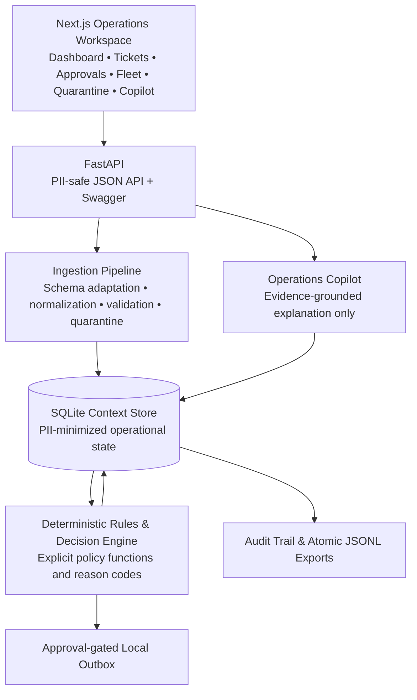
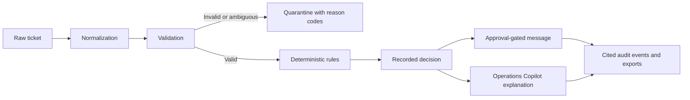

# Synq AI Forward Deployment Challenge — Meridian Freight

> A deterministic, PII-safe operations control plane for turning breakdown tickets into auditable, approval-gated outcomes.

[](https://www.python.org/)
[](https://fastapi.tiangolo.com/)
[](https://nextjs.org/)
[](https://sqlite.org/)
[](#challenge-overview)

Meridian Freight gives dispatch teams a safe way to process operational breakdown tickets from fragmented fleet, maintenance, driver, and policy evidence. It is deliberately conservative: deterministic rules remain the sole authority for dispatch outcomes, missing evidence produces a manual hold, and an optional AI copilot explains—never decides—what the system found.

## Live demo

Deployment URLs are intentionally not hard-coded in this repository. Add the approved public service addresses after deployment:

| Service | URL |
| --- | --- |
| Next.js operations workspace | `https://<frontend-service>/` |
| FastAPI API | `https://<backend-service>/health` |
| Swagger / OpenAPI | `https://<backend-service>/docs` |

For a local demo, use [Running locally](#running-locally). The app seeds a safe, synthetic dataset on its first empty-database startup.

## Challenge overview

This project implements the Synq AI Forward Deployment Challenge as a FastAPI backend and Next.js operations workspace. It safely ingests the operational corpus or a schema-adapted surprise ticket file, records only PII-minimized facts, applies explicit policy functions, produces auditable outcomes, and keeps all external communications approval-gated.

## Problem statement

Breakdown dispatch is operationally difficult because its inputs are fragmented and uneven: a ticket may conflict with fleet history, maintenance evidence, driver eligibility, or a client-specific policy. An operator still needs a repeatable answer to three questions: what happened, why did the system stop or proceed, and what evidence supports that answer.

That makes deterministic decision-making essential. A plausible-sounding model answer is not an acceptable basis for dispatching a vehicle or approving a customer message. This application explicitly models known rules, fails safely when required facts are absent, preserves cited evidence, and reserves communication for a human approval step.

## Solution

- **Deterministic rules engine:** Explicit, unit-tested rules evaluate operational eligibility and produce reason codes. The engine never guesses missing facts.
- **Operations Copilot:** GPT can turn retrieved, PII-safe backend evidence into a concise operator explanation. It cannot call tools, dispatch vehicles, evaluate rules, approve messages, or change data.
- **Human approval queue:** A pending message is created locally and becomes a sent-outbox record only after a valid opaque role or operator handle approves it.
- **Audit and evidence:** Stable IDs, source citations, deterministic exports, and audit events make every outcome reviewable.
- **PII protection:** Source content is reduced to allowlisted structured facts before persistence, export, API response, or model prompting.

## Features

- ✅ Deterministic Rules Engine
- ✅ Operations Copilot (AI explanation only)
- ✅ Human Approval Queue
- ✅ Vehicle Lookup
- ✅ Ticket Management
- ✅ Quarantine Review
- ✅ Grounded AI Explanations
- ✅ PII-safe Processing
- ✅ Audit Trail and deterministic JSONL exports
- ✅ Automatic synthetic demo-data seeding
- ✅ Render deployment guidance

## Architecture



## End-to-end workflow



1. Ingest reference sources and ticket input.
2. Normalize identifiers and persist allowlisted, PII-safe facts only.
3. Quarantine malformed records and ambiguous surprise-file mappings with explicit reasons.
4. Evaluate explicit rules against the normalized ticket and stored evidence.
5. Create at most one work order and one pending approval message per canonical ticket.
6. Record audit events and atomically regenerate deterministically sorted JSONL outputs.
7. Require an authorized opaque role/operator handle before recording a local sent-outbox event.
8. For an explanation, retrieve structured evidence first. If it is insufficient, return `INSUFFICIENT_DATA` without calling GPT.

## Screenshots

Screenshots can be added under `docs/screenshots/` without changing this README. These Markdown placeholders intentionally point to the future assets.

| View | Placeholder |
| --- | --- |
| Dashboard |  |
| Tickets |  |
| Pending approvals |  |
| Vehicle lookup |  |
| Quarantine |  |
| Operations Copilot |  |
| Swagger UI |  |

## Folder structure

```text
.
├── backend/
│   ├── app/                   # API, ingestion, context, rules, decisions, approvals, AI explanations
│   ├── demo_data/             # Safe synthetic startup dataset (committed)
│   ├── tests/                 # Deterministic backend tests
│   ├── data/                  # Runtime SQLite database (gitignored)
│   ├── outputs/               # Generated JSONL artifacts (gitignored)
│   ├── audit/                 # Generated audit artifacts (gitignored)
│   ├── pyproject.toml         # Backend package metadata and dependencies
│   └── run.ps1                # Windows helper for the CLI workflow
├── frontend/
│   ├── app/                   # Dashboard, tickets, approvals, vehicles, quarantine, Ask AI routes
│   ├── components/            # Shared UI components
│   ├── lib/                   # Typed client for the FastAPI reverse proxy
│   ├── .env.example           # Frontend server-side backend URL template
│   └── package.json           # Next.js scripts and dependencies
├── candidate_bundle/          # Local challenge inputs only (gitignored; never commit)
├── .env.example               # Backend OpenAI configuration template
├── CONTRIBUTING.md            # Contribution and safety guidance
└── LICENSE                    # MIT License
```

## API documentation

Interactive OpenAPI documentation is served at [`/docs`](http://127.0.0.1:8000/docs) when the backend is running.

| Method | Path | Purpose |
| --- | --- | --- |
| `GET` | `/health` | Service and database readiness check. |
| `POST` | `/run` | Ingest and process the default corpus or a safely scoped surprise-ticket file. |
| `POST` | `/approve` | Approve a pending ticket message into the local sent outbox. |
| `POST` | `/query` | Retrieve structured, cited evidence for one ticket or vehicle. |
| `POST` | `/explain` | Explain retrieved PII-safe evidence; never decides or mutates state. |
| `GET` | `/ticket/{ticket_id}` | Retrieve one PII-safe ticket result. |
| `GET` | `/tickets` | List canonical ticket projections. |
| `GET` | `/vehicles` | List PII-safe vehicle projections. |
| `GET` | `/quarantine` | List ticket and file quarantines. |
| `GET` | `/approvals/pending` | List messages awaiting human approval. |
| `GET` | `/docs` | Swagger UI. |
| `GET` | `/openapi.json` | OpenAPI schema. |

### Example requests

The automatic demo dataset includes `TKT-0001` and `TKT-0028`; it also intentionally contains one invalid record for quarantine review.

```powershell
# Backend running at http://127.0.0.1:8000
Invoke-RestMethod http://127.0.0.1:8000/health
Invoke-RestMethod http://127.0.0.1:8000/tickets
Invoke-RestMethod http://127.0.0.1:8000/ticket/TKT-0001

Invoke-RestMethod -Method Post http://127.0.0.1:8000/query `
  -ContentType 'application/json' `
  -Body '{"vehicle_reg":"DL01AA1001"}'

Invoke-RestMethod -Method Post http://127.0.0.1:8000/explain `
  -ContentType 'application/json' `
  -Body '{"ticket_id":"TKT-0001","question":"Why did automation stop?"}'

Invoke-RestMethod -Method Post http://127.0.0.1:8000/approve `
  -ContentType 'application/json' `
  -Body '{"ticket_id":"TKT-0001","approved_by":"role-dispatch","approved_at":"2026-08-30T10:00:00Z"}'
```

`/approve` records a local outbox event only; it does not send external email, SMS, or other communication.

## Installation

### Prerequisites

- Python 3.11+
- Node.js 20+ and pnpm

### Backend

```powershell
cd backend
python -m venv .venv
.\.venv\Scripts\Activate.ps1
python -m pip install --upgrade pip
pip install -e .
pip install httpx
```

`httpx` is required by FastAPI's test client. It is installed separately above because the current package metadata does not declare it as a runtime dependency.

### Frontend

```powershell
cd frontend
Copy-Item .env.example .env
pnpm install
```

## Environment variables

### Backend (`.env` at repository root)

Copy the template first:

```powershell
Copy-Item .env.example .env
```

| Variable | Required | Description |
| --- | --- | --- |
| `OPENAI_API_KEY` | Only for `/explain` | Backend-only API key used for grounded explanations. If absent, `/explain` returns a clear HTTP 503 configuration error. |
| `OPENAI_MODEL` | No | Model name for explanations. Defaults to `gpt-5`. |

### Frontend (`frontend/.env`)

| Variable | Required | Description |
| --- | --- | --- |
| `BACKEND_URL` | Yes outside local default | Server-side FastAPI origin used by Next.js `/api/*` rewrites. Defaults to `http://127.0.0.1:8000`. |

Do not commit populated `.env` files. `OPENAI_API_KEY` is never exposed to the browser and is not a `NEXT_PUBLIC_*` variable.

## Running locally

Start the backend from `backend/`:

```powershell
.\.venv\Scripts\Activate.ps1
uvicorn app.api:app --host 127.0.0.1 --port 8000
```

On the first startup with an empty operational database, FastAPI seeds `backend/demo_data/` through the normal ingestion and processing pipeline. Visit [Swagger UI](http://127.0.0.1:8000/docs) to inspect the API.

In a second terminal, start the frontend:

```powershell
cd frontend
pnpm dev
```

Open [http://127.0.0.1:3000](http://127.0.0.1:3000). The frontend calls FastAPI through its server-side `/api/*` rewrite; it never handles the backend OpenAI key.

## Running tests

Run the backend suite from the repository root:

```powershell
cd backend
python -m unittest discover -s tests -v
```

The current backend suite contains **32 tests** covering API safety, ingestion, validation, redaction, deterministic rules, selection, idempotent processing, approval behavior, grounded explanation boundaries, surprise-file handling, and automatic demo seeding.

Build the frontend for production:

```powershell
cd frontend
pnpm build
```

## Deploying on Render

This repository does not prescribe a single hosted URL or include a Render manifest. Configure the services in Render using the existing application commands below, then set the resulting backend origin as the frontend's `BACKEND_URL`.

### Backend web service

| Setting | Value |
| --- | --- |
| Runtime | Python 3 |
| Root directory | `backend` |
| Build command | `pip install . && pip install httpx` |
| Start command | `uvicorn app.api:app --host 0.0.0.0 --port $PORT` |

Set `OPENAI_API_KEY` only as a Render secret if the explanation endpoint should be enabled. `OPENAI_MODEL` is optional.

The application starts safely with a fresh database: it ingests the committed synthetic demo data once through the normal pipeline. A restart detects the existing operational records and does not reset, overwrite, or duplicate them. Attach a Render persistent disk for SQLite/audit/output retention across deploys; a non-persistent filesystem starts fresh after a redeploy.

### Frontend web service

| Setting | Value |
| --- | --- |
| Runtime | Node |
| Root directory | `frontend` |
| Build command | `pnpm install --frozen-lockfile && pnpm build` |
| Start command | `pnpm start` |
| Environment | `BACKEND_URL=https://<backend-service>` |

The supplied frontend uses a server-side rewrite, so `BACKEND_URL` points to the backend service and is not sent to browser JavaScript.

## Demo dataset

Original challenge material belongs in `candidate_bundle/`, which is excluded from Git. That avoids publishing raw source files, emails, interview transcripts, spreadsheets, PDFs, or potentially personal data.

`backend/demo_data/` is deliberately different: it is a small, synthetic, committed dataset containing safe operational identifiers and no names, contacts, or real-source content. It exercises the same validators, normalizers, context ingestion, rules, approval workflow, audit trail, and exports as ordinary input.

At application startup, an empty operational store is seeded once. If any operational record exists, seeding is skipped. This makes startup deterministic, idempotent, and safe for restarts without overwriting production state.

## Security and privacy

- **PII minimization:** Candidate sources are not copied wholesale into the context store. Raw names, phone numbers, email addresses, Aadhaar values, driver-license values, mechanics, and free-form operational text are excluded from persisted context and evaluator-visible artifacts.
- **Grounded AI:** GPT receives only retrieved, structured, redacted backend evidence and a scrubbed transient question. Missing evidence returns `INSUFFICIENT_DATA` without a model call.
- **Deterministic authority:** AI cannot select a replacement vehicle, dispatch, approve, quarantine, evaluate a rule, or otherwise mutate operational state.
- **Human approval:** Pending communications require a valid opaque `role-*` or `operator-*` approval handle before entering the local sent outbox.
- **Auditability:** Stable identifiers, source citations, database uniqueness constraints, explicit quarantine records, and deterministic JSONL exports preserve an inspectable trail.

## Design decisions

| Decision | Why |
| --- | --- |
| Rules, not GPT, decide operations | Dispatch outcomes require explicit, repeatable, testable logic—not model inference. |
| Missing evidence causes a hold | A manual hold is safer and more honest than inferring availability, eligibility, or maintenance status. |
| Explain after retrieval | The Copilot's prompt is assembled only from backend evidence; it has no route to make or alter a decision. |
| SQLite for the MVP | It makes state, uniqueness constraints, and auditability simple to inspect for a single-service challenge deployment. |
| Quarantine rather than discard | Invalid records and uncertain schema mappings remain reviewable with explicit reason codes. |

## Limitations

- There is no live telematics, routing, maintenance, or notification-system integration; absent live facts safely produce a manual hold.
- Approval records a local outbox event only and does not send a real external message.
- SQLite requires a persistent disk and appropriate operational controls before multi-instance production use.
- `/explain` depends on a configured OpenAI key but remains explanation-only even when enabled.
- Screenshots and public deployment URLs are intentionally not committed yet.

## Repository roadmap

- [x] Backend
- [x] Frontend
- [x] Operations Copilot
- [x] Demo Seeding
- [x] Render Deployment guidance
- [ ] Authentication
- [ ] PostgreSQL
- [ ] Docker
- [ ] CI/CD
- [ ] Analytics

## Contributing

See [CONTRIBUTING.md](CONTRIBUTING.md) for development expectations, testing, PII safeguards, and pull-request guidance.

## License

This project is available under the [MIT License](LICENSE).
